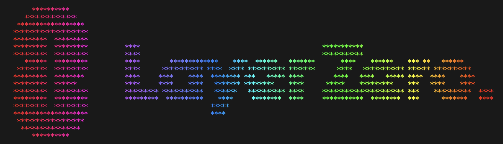
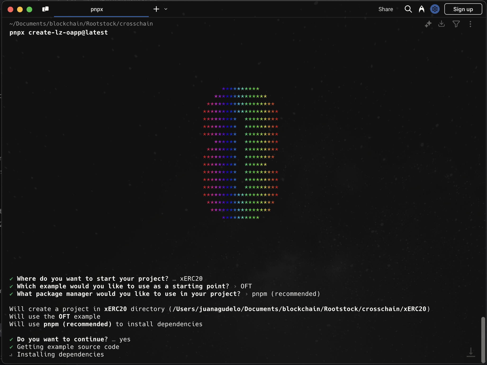

<p align="center">
  <a href="https://layerzero.network">
    
  </a>
</p>

<h1 align="center">Omnichain Fungible Token xERC20</h1>

## Introduction

This guide demonstrates implementing cross-chain token transfers using **OFT** (Omnichain Fungible Token) between **Rootstock Testnet** and **Ethereum Sepolia Testnet** via **LayerZero's OFT V2 protocol**.

You'll learn to:
- Set up Hardhat for cross-chain deployments
- Deploy an OFT contract for token transfers between chains
- Configure LayerZero endpoints for cross-chain communication
- Execute transfers between Rootstock and Ethereum Sepolia testnets

## Prerequisites

To complete this guide, you'll need:

- **Node.js**: v18.18.0+ ([Download Node.js](https://nodejs.org/en/download) or use [NVM](https://github.com/nvm-sh/nvm) to manage Node versions)
- **Code Editor**: Any editor of your choice
- **RPC Providers**: 
  - [Alchemy](https://www.alchemy.com/) or [Infura](https://infura.io/) for Ethereum Sepolia
  - [Rootstock RPC](https://rpc.rootstock.io/) for Rootstock Testnet
- **Metamask**: [Install](https://metamask.io/) and connect to [Ethereum Sepolia](https://chainlist.org/chain/11155111) and [Rootstock Testnet](https://chainlist.org/chain/31)
- **Test Funds**: [Sepolia ETH](https://sepoliafaucet.com/) and [Rootstock RBTC](https://faucet.rootstock.io/)

> **Important**: Ensure you have sufficient test tokens on both networks.

## Project Setup

### 1. Create a New LayerZero Project

First, navigate to the folder you want to create your project and run the following command to create a new LayerZero project:

```zsh
npx create-lz-oapp@latest
```

<p align="center">
  <a href="https://layerzero.network">
    
  </a>
</p>

### 2. Setup environment variables

Rename the `.env.example` file to `.env` and update the environment variables with your own values.


```markdown
# By default, the examples support both mnemonic-based and private key-based authentication
# 
# You don't need to set both of these values, just pick the one that you prefer and set that one
MNEMONIC=
PRIVATE_KEY=
```

### 3. Configure chains 

Once the project is created, go to `hardhat.config.ts` and configure the chains you want to deploy to.

> **Note**: For better performance and reliability, use a custom RPC endpoint as suggested in the prerequisites section.

```typescript
networks: {
    'sepolia-testnet': {
        eid: EndpointId.SEPOLIA_V2_TESTNET,
        url: process.env.RPC_URL_SEPOLIA || 'https://ethereum-sepolia-rpc.publicnode.com',
        accounts,
    },
    'rootstock-testnet': {
        eid: EndpointId.ROOTSTOCK_V2_TESTNET,
        url: process.env.RPC_URL_ROOTSTOCK_TESTNET || 'https://public-node.testnet.rsk.co',
        accounts,
    }
}
```
### 5. Deploying contracts

After adding your MNEMONIC or PRIVATE_KEY to your dotenv file and adding networks in your hardhat.config.ts, run the following command to deploy your LayerZero contracts:


```bash
npx hardhat lz:deploy
```

You will be prompted to select which chains to deploy to, if you wish to deploy to all blockchain networks selected, simply hit enter to continue deployment.


```typescript
info:    Compiling your hardhat project
Nothing to compile
✔ Which networks would you like to deploy? › rootstock-testnet, sepolia-testnet
✔ Which deploy script tags would you like to use? … 
info:    Will deploy 2 networks: rootstock-testnet, sepolia-testnet
warn:    Will use all deployment scripts
✔ Do you want to continue? … yes
Network: sepolia-testnet
Deployer: 0xD742C64Ab7ba8d31cee0594b4dc61b1ed8321246
Network: rootstock-testnet
Deployer: 0xD742C64Ab7ba8d31cee0594b4dc61b1ed8321246
Deployed contract: MyOFT, network: sepolia-testnet, address: 0x185f688cf370cB810D7Be1FEa9e934d2863eeC09
Deployed contract: MyOFT, network: rootstock-testnet, address: 0xFB6D255Cc45855A135A02DBED84743ac2009A3c0
info:    ✓ Your contracts are now deployed
```

### 6. Configuring layerzero OApp

To configure your OApp, you will need to change your layerzero.config.ts for your desired pathways. In this example, we will be using the `MyOFT` contract for our OFT. 


You can initialize your OApp configurations by running:

```bash
npx hardhat lz:oapp:config:init --contract-name MyOFT --oapp-config layerzero.config.ts
```

Once this command is executed, you will be prompted to select the chain you setup in your layerzero.config.ts file. 

```typescript 
✔ Select the networks to include in your OApp config › rootstock-testnet, sepolia-testnet
```

Then go to your layerzero.config.ts file and format it using cmd + shift + p and select `Format Document`.

Each pathway contains a config, containing multiple configuration structs for changing how your OApp sends and receives messages, specifically for the chain your OApp is sending from:

| Name | Type | Description |
|:-----|:-----|:------------|
| `sendLibrary` | Address | The message library used for configuring all sent messages `from` this chain. (e.g., `SendUln302.sol`) |
| `receiveLibraryConfig` | Struct | A struct containing the receive message library address (e.g., `ReceiveUln302.sol`), and an optional BigInt, `gracePeriod`, the time to wait before updating to a new MessageLib version during version migration. Controls how the `from` chain receives messages. |
| `receiveLibraryTimeoutConfig` | Struct | An optional param, defining when the old receive library (`lib`) will expire (`expiry`) during version migration. |
| `sendConfig` | Struct | Controls how the OApp sends `from` this pathway, containing two more structs: `executorConfig` and `ulnConfig` (DVNs). |
| `receiveConfig` | Struct | Controls how the OApp (`from`) receives messages, specifically the `ulnConfig` (DVNs). |
| `enforcedOptions` | Struct | Controls the minimum destination gas sent to the destination, per message type (e.g., `_lzReceive`, `lzCompose`, etc.) in your OApp. |

[Deployed Contracts](https://docs.layerzero.network/v2/developers/evm/technical-reference/deployed-contracts)

[DVN Addresses](https://docs.layerzero.network/v2/developers/evm/technical-reference/dvn-addresses)

### 7. Wiring the OApp

```bash
npx hardhat lz:oapp:wire --oapp-config layerzero.config.ts
```

This command sets up the necessary connections between your deployed contracts on different chains.

You can monitor your cross-chain transactions using:

- [LayerZero Scan](https://layerzeroscan.com/) - Official LayerZero explorer
- [Rootstock Explorer](https://explorer.testnet.rsk.co/) - For Rootstock testnet transactions
- [Sepolia Etherscan](https://sepolia.etherscan.io/) - For Ethereum Sepolia transactions

## Troubleshooting

If you encounter issues:

- Ensure you have sufficient test tokens on both networks
- Verify your RPC endpoints are working correctly
- Check that your contracts are properly configured for cross-chain messaging
- Examine transaction logs for specific error messages

## Resources

- [LayerZero Documentation](https://docs.layerzero.network/)
- [OFT Standard Specification](https://docs.layerzero.network/contracts/oft)
- [Rootstock Documentation](https://developers.rsk.co/)

